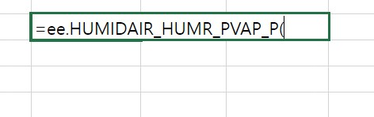
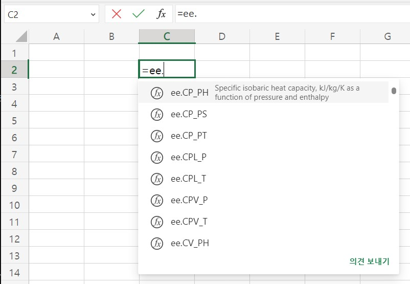
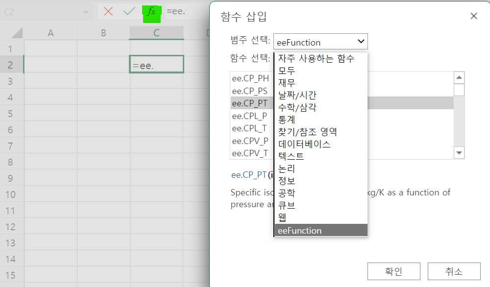

import { LinkCard, CardGrid } from '@astrojs/starlight/components';

import Button from '../../../../components/Button.astro';
import Discord from '../../../../components/Discord.astro';

import { Image } from 'astro:assets';

{/* <Discord title="Have a question or want to get involved?" cta="Join our Discord"/> */}

`eeFunction`은 Fluid mechanics, Thermodynamics을 위한 Excel Addin 입니다.
인터넷에 공유된 source code를 기반으로 엑셀에서의 다양한 -사용자함수-를 제공합니다.    
개인/기업에서 무료로 사용할 수 있습니다.

{/* <LinkCard
  title="Goto installation manual page"
  description="아직 본 페이지는 작성 중입니다. 위 사이트에서 설치하세요"
  href="https://theangkko.github.io/eefunctionmanual"
/> */}

  

### Office Add-ins 사용환경

Office Add-ins의 기능은 Microsoft 홈페이지에 표기된 사양에 따라 ~~엑셀2016버전~~ __엑셀2021__ 이상에서 실행가능합니다.   
또한 맥Mac, Office365-Web버전에서도 사용가능합니다

> Note that Excel custom functions are available on the following platforms.
> - Office on Windows
>     - Microsoft 365 subscription
>     - retail perpetual Office 2016 and later
> - Office on Mac
> - Office on the web      
>    
> Excel custom functions are currently not supported in the following:   
> - Office on iPad
> - volume-licensed perpetual versions of Office 2019 or earlier

  
  

### How to use 사용방법
엑셀 기본함수 외에, 추가로 사용자함수(UDF)를 쓰려면 VBA을 사용합니다.
Office Add-ins에서도 `Javascript API`를 사용하여 VBA와 유사한 기능을 제공합니다. 이를 **Custom Function**이라고 하며, eeFunction은 이러한 기능의 집합입니다.

간단한 사용법은 아래 영상을 참고하십시오.

 
 
 
   
엑셀 기본함수와 동일하게 함수입력창(fx)에 `=`를 입력하면 Custom Function을 사용할 수 있습니다. 사용하려는 함수명을 입력하면 사용가능한 함수 목록이 보입니다.
예를 들어, `=air` 라고만 입력하더라도 함수명에 air를 포함하고 있으면 모두 표시가 됩니다.

import image_ee010 from '../../../../assets/eefunction/230531_ee010InputFunction.jpg';

<Image src={image_ee010} alt="" width="500" />
{/*    */}

{/*      */}
{/* <Image src={"../../../assets/eefunction/230531_ee010InputFunction.jpg"} alt="" width="400" height="300"/> */}
 
 
 
 
 
 
   
함수자동완성 기능을 활용하면 함수명을 모두 입력하지 않고도 빠르게 입력할 수 있습니다. 위에서 `=air` 라고 입력한 상태에서 방향키 위/아래로 사용하려는 함수를 선택합니다. 그리고 `TAB`키를 누르면 나머지 부분이 완성됩니다.

{/*  */}
{/*      */}

import image_ee011 from '../../../../assets/eefunction/230531_ee011InputFunction.jpg';

<Image src={image_ee011} alt="" width="350" />

 
 
 
 

eeFunction에서 사용가능한 **모든 함수**의 목록을 보려면 `=ee.`를 입력합니다.   

{/*     */}
{/*  */}

import image_ee012 from '../../../../assets/eefunction/230531_ee012InputFunction.jpg';

<Image src={image_ee012} alt="" width="650" />
 
 
 
 

상세한 설명과 도움말을 보려면 함수입력창의 (fx)를 클릭하고 -범주선택-에서 **eeFunction**을 선택하면 함수목록과 각 함수의 상세설명을 볼 수 있습니다. 

  
{/*  */}

 
 
 
 

