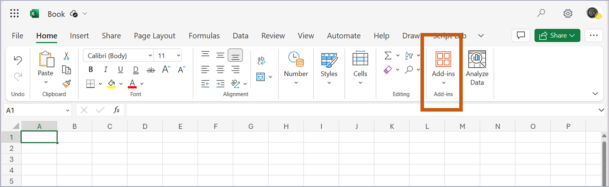

import { LinkCard, CardGrid } from '@astrojs/starlight/components';
import ButtonDownload from '../../../../components/ButtonDownload.astro';


설치하는 방법에 대해서 설명합니다.
MS Appsource에서 설치하는 방법이 아닌, Side-Loading방식의 설치입니다.
크게 2가지 방법이 있습니다.
- Web Browser 버전의 엑셀에 설치
- Desktop App 버전의 엑셀에 설치

<br/>

## For Web Browser, installation

#### 1) Download manifest for eeFunction
터미널Terminal 또는 명령프롬프트CMD 창에서 아래 명령어를 입력하거나 Download 버튼을 눌러 Add-in 설치용 'manifest_eeFunction.xml'을 다운받습니다.


{/* <LinkCard
  title="manifest download"
  description="다음 주소에서 다운로드버튼을 이용해서 설치하세요"
  href="https://eefunction.pages.dev/manifest_eeFunction.xml"
/> */}

<ButtonDownload />

``` powershell or bash
curl.exe --output C:\manifest/manifest_eeFunction.xml --url https://eefunction.pages.dev/manifest_eeFunction.xml --ssl-no-revoke
```

<br/>
<br/>


#### 2) Upload Add-in

Web브라우저(Chrome/MS Edge/Safari)에서 Office365-WebExcel 파일을 엽니다.   
Shared Folder: [O365 OneDrive](https://1drv.ms/x/s!AjtDw6AXQrGwhQh0jH3LZTgVy5qx?e=Re8Hnc)



(KOR)
- "추가기능" 메뉴를 선택합니다.
- "내 추가기능 업로드"을 선택합니다.
- 다운받은 파일 -manifest_eeFunction.xml-을 업로드 합니다.
- 엑셀 상단메뉴바에 -eeFunction-이 추가되면 기능을 사용할 수 있습니다.

(ENG)
- Select "Add-ins" in Top ribbon menu
- Select "Upload My Add-in"
- Upload the file -manifest_eeFunction.xml-
- Use custom function if -eeFunction- title shows at excel ribbon MenuBar


<br/><br/>

## For Desktop, installation
기본적으로 Office Add-ins은 Web/Desktop 구분없이 사용가능합니다.    

eeFunction에서 제공하는 일부 함수는 Web Assembly 기반으로 작성되어 있습니다.
이는 브라우저에서는 동작하지만 Desktop에서는 동작하지 않습니다.

따라서, 현재는 Desktop Module을 별도로 제공하지 않습니다.


<br/><br/>

## Update for Latest version
아래 cmd 파일을 통해 최신버전을 `c:\manifest` 폴더에 다운받으실 수 있습니다.    
With Manifest Updater, latest manifest.xml will be downloaded at `c:\manifest` folder.

https://eefunction.pages.dev/manifest_download_eeFunction.cmd

<br/>

크롬/엣지/사파리 브라우저에서 Add-ins 항목을 다시 업로드하시면 됩니다.    
In Chrome/Edge/Safari web-browser, **re-upload** your manifest.xml file.


<br/><br/><br/><br/>
