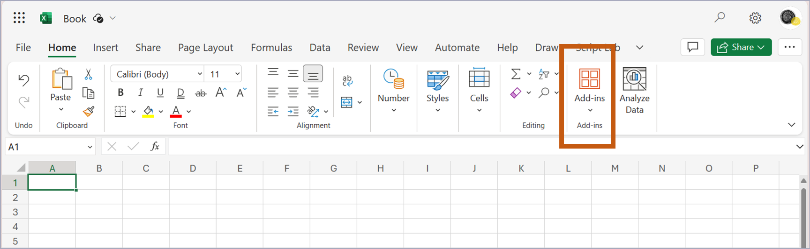

import ButtonDownload from '../../../../components/ButtonDownload.astro';


설치하는 방법에 대해서 설명합니다.
MS Appsource에서 설치하는 방법이 아닌, Side-Loading방식의 설치입니다.
크게 2가지 방법이 있습니다.
- Web Browser 버전의 엑셀에 설치
- Desktop App 버전의 엑셀에 설치

<br/>

## 웹 브라우저에서 설치

#### 1) eeFunction manifest 다운로드
터미널 또는 명령 프롬프트 창에서 아래 명령어를 입력하거나 Download 버튼을 눌러 Add-in 설치용 `manifest_eeFunction.xml`을 다운로드합니다.


<ButtonDownload />

``` powershell or bash
curl.exe --output C:\manifest/manifest_eeFunction.xml --url https://eefunction.pages.dev/manifest_eeFunction.xml --ssl-no-revoke
```

<br/>
<br/>


#### 2) Add-in 업로드

Web브라우저(Chrome/MS Edge/Safari)에서 Office365-WebExcel 파일을 엽니다.   
Shared Folder: [O365 OneDrive](https://1drv.ms/x/s!AjtDw6AXQrGwhQh0jH3LZTgVy5qx?e=Re8Hnc)



- "추가기능" 메뉴를 선택합니다.
- "내 추가기능 업로드"을 선택합니다.
- 다운로드한 `manifest_eeFunction.xml` 파일을 업로드합니다.
- Excel 상단 메뉴에 `eeFunction`이 추가되면 기능을 사용할 수 있습니다.


<br/><br/>

## 데스크톱 Excel 설치
기본적으로 Office Add-ins은 Web/Desktop 구분없이 사용가능합니다.    

eeFunction에서 제공하는 일부 함수는 Web Assembly 기반으로 작성되어 있습니다.
이는 브라우저에서는 동작하지만 Desktop에서는 동작하지 않습니다.

따라서, 현재는 Desktop Module을 별도로 제공하지 않습니다.


<br/><br/>

## 최신 버전으로 업데이트
아래 cmd 파일을 통해 최신 버전을 `c:\manifest` 폴더에 다운로드할 수 있습니다.

https://eefunction.pages.dev/manifest_download_eeFunction.cmd

<br/>

크롬/엣지/사파리 브라우저에서 Add-ins 항목을 열고 manifest.xml 파일을 **다시 업로드**하면 됩니다.


<br/><br/><br/><br/>
