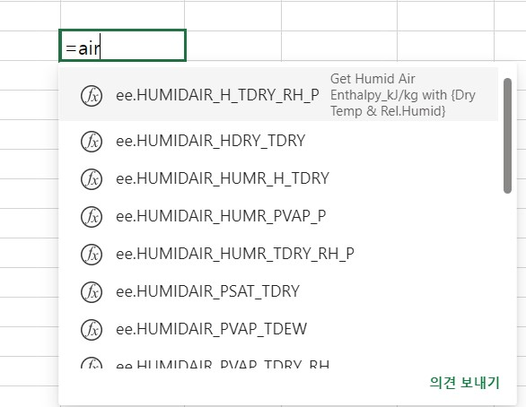

import { LinkCard, CardGrid } from '@astrojs/starlight/components';

import Button from '../../../components/Button.astro';
import Discord from '../../../components/Discord.astro';

import { Image } from 'astro:assets';

{/* <Discord title="Have a question or want to get involved?" cta="Join our Discord"/> */}

`eeFunction` is an Excel Add-in for Fluid mechanics and Thermodynamics.
Based on source code shared on the internet, it provides various user-defined functions in Excel.
It is free to use for both personal and corporate purposes.

{/* <LinkCard
  title="Goto installation manual page"
  description="아직 본 페이지는 작성 중입니다. 위 사이트에서 설치하세요"
  href="https://theangkko.github.io/eefunctionmanual"
/> */}

  

### Office Add-ins Usage Environment

According to the specifications listed on the Microsoft homepage, Office Add-ins functionality is available on ~~Excel 2016~~ __Excel 2021__ and later versions.
It is also available on Mac and Office 365 Web versions.

> Note that Excel custom functions are available on the following platforms.
> - Office on Windows
>     - Microsoft 365 subscription
>     - retail perpetual Office 2016 and later
> - Office on Mac
> - Office on the web      
>    
> Excel custom functions are currently not supported in the following:   
> - Office on iPad
> - volume-licensed perpetual versions of Office 2019 or earlier

  
  

### How to Use
In addition to Excel's built-in functions, you need to use VBA to add user-defined functions (UDF).
Office Add-ins also provide functionality similar to VBA using the `Javascript API`. This is called **Custom Functions**, and eeFunction is a collection of such functions.

For simple usage instructions, please refer to the video below.

 
 
 
   
Just like Excel's built-in functions, you can use Custom Functions by entering `=` in the function input box (fx). When you start typing the function name, you'll see a list of available functions.
For example, even if you just type `=air`, all functions that include "air" in their name will be displayed.

import image_ee010 from '../../../assets/eefunction/230531_ee010InputFunction.jpg';

<Image src={image_ee010} alt="" width="500" />
{/*    */}

{/*      */}
{/* <Image src={"../../../assets/eefunction/230531_ee010InputFunction.jpg"} alt="" width="400" height="300"/> */}
 
 
 
 
 
 
   
Using the function auto-complete feature, you can quickly enter functions without typing the entire function name. After typing `=air`, select the function you want to use with the up/down arrow keys. Then press the `TAB` key to complete the rest.

{/*  */}
{/*      */}

import image_ee011 from '../../../assets/eefunction/230531_ee011InputFunction.jpg';

<Image src={image_ee011} alt="" width="350" />

 
 
 
 

To see a list of **all available functions** in eeFunction, type `=ee.`.   

{/*     */}
{/*  */}

import image_ee012 from '../../../assets/eefunction/230531_ee012InputFunction.jpg';

<Image src={image_ee012} alt="" width="650" />
 
 
 
 

To view detailed descriptions and help, click (fx) in the function input box and select **eeFunction** from the category selection to see the function list and detailed descriptions of each function.

  
{/*  */}

 
 
 
 

