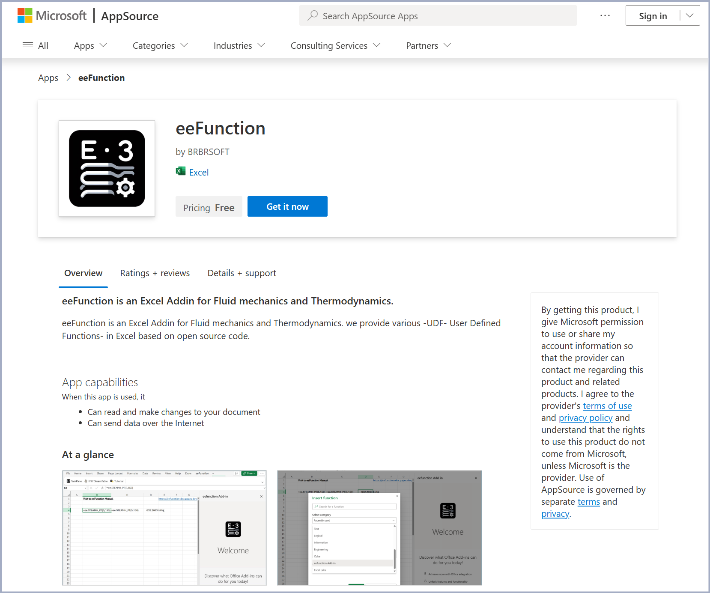
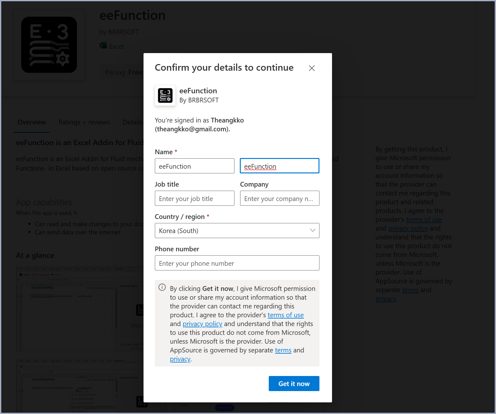
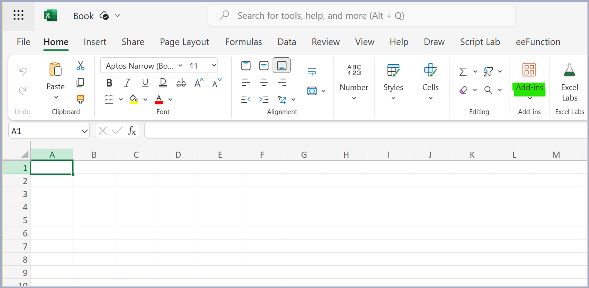
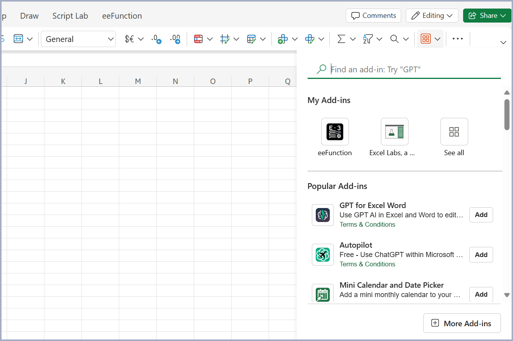
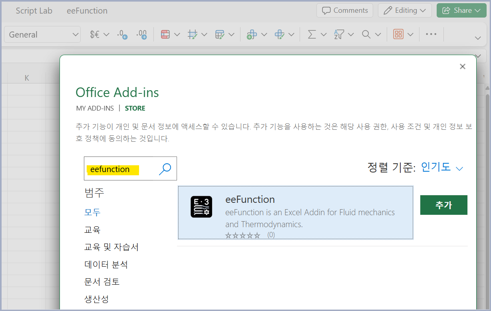

import { LinkCard, CardGrid } from '@astrojs/starlight/components';
import ButtonDownload from '../../../components/ButtonDownload.astro';

{/* https://go.microsoft.com/fwlink/?linkid={{linkId}}&templateid={{addInId}}&templatetitle={{addInName}} */}
{/* https://go.microsoft.com/fwlink/?linkid=2261819&templateid=WA200007295&templatetitle=eeFunction */}
{/* ms-excel:https://api.addins.store.office.com/addinstemplate/en-US/28baf52b-a8c6-243e-b16a-7b8419599868/WA200007295/none/eeFunction.xlsx?omexsrctype=1  */}

You can easily install through the following links.    
  <a href="https://go.microsoft.com/fwlink/?linkid=2261819&templateid=WA200007295&templatetitle=eeFunction" target="_blank">Install with Web-Browser</a>    
  <a href="ms-excel:https://api.addins.store.office.com/addinstemplate/en-US/28baf52b-a8c6-243e-b16a-7b8419599868/WA200007295/none/eeFunction.xlsx?omexsrctype=1" target="_blank">Install with Desktop PC</a>
   
   
   

Other installation methods include:
- Add from MS AppSource
- Search and add from Excel Add-ins

### Using Microsoft AppSource

- Go to the MS AppSource URL address.  <a href="https://appsource.microsoft.com/en-us/product/office/WA200007295?tab=Overview" target="_blank"> LINK </a>
- Click the `Get it Now` button to add the Office Add-ins.
- If you're not logged in to Office365 (Excel), go through the login process.
- If installed successfully, the `eeFunction` menu will be created in the top menu.

{/*  */}

  

### Using Add-ins Menu in Excel
- In Excel, select Home > Add-ins menu.

 
- Search for `eeFunction` in the Office Add-ins search menu.

 
- Install the Add-in that appears in the search by clicking the `Add` button.

  

### For Desktop App-Excel, Only Some Functions Are Available
By default, Office Add-ins can be used regardless of Web/Desktop.    

Some functions provided by eeFunction are written based on Web Assembly.   
This works fine in Web-Excel running in a browser, but does not work in Desktop-Excel.   
For example, the CoolProp command `=ee.PROPSSI` falls into this category.   

    

