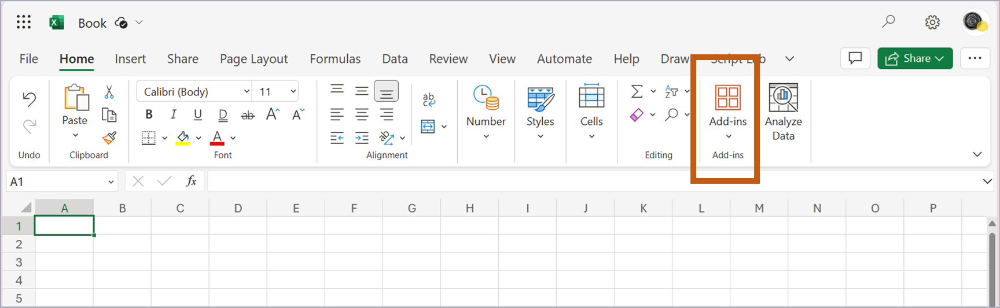

import { LinkCard, CardGrid } from '@astrojs/starlight/components';
import ButtonDownload from '../../../components/ButtonDownload.astro';


This explains the installation method.
This is a Side-Loading installation, not from MS AppSource.
There are two main methods:
- Install in Web Browser version of Excel
- Install in Desktop App version of Excel

<br/>

## For Web Browser, Installation

#### 1) Download Manifest for eeFunction
Enter the following command in the Terminal or Command Prompt window, or click the Download button to download 'manifest_eeFunction.xml' for Add-in installation.


{/* <LinkCard
  title="manifest download"
  description="다음 주소에서 다운로드버튼을 이용해서 설치하세요"
  href="https://eefunction.pages.dev/manifest_eeFunction.xml"
/> */}

<ButtonDownload />

``` powershell or bash
curl.exe --output C:\manifest/manifest_eeFunction.xml --url https://eefunction.pages.dev/manifest_eeFunction.xml --ssl-no-revoke
```

<br/>
<br/>


#### 2) Upload Add-in

Open an Office365-WebExcel file in a web browser (Chrome/MS Edge/Safari).   
Shared Folder: [O365 OneDrive](https://1drv.ms/x/s!AjtDw6AXQrGwhQh0jH3LZTgVy5qx?e=Re8Hnc)



(KOR)
- "추가기능" 메뉴를 선택합니다.
- "내 추가기능 업로드"을 선택합니다.
- 다운받은 파일 -manifest_eeFunction.xml-을 업로드 합니다.
- 엑셀 상단메뉴바에 -eeFunction-이 추가되면 기능을 사용할 수 있습니다.

(ENG)
- Select "Add-ins" in Top ribbon menu
- Select "Upload My Add-in"
- Upload the file -manifest_eeFunction.xml-
- Use custom function if -eeFunction- title shows at excel ribbon MenuBar


<br/><br/>

## For Desktop, Installation
By default, Office Add-ins can be used regardless of Web/Desktop.    

Some functions provided by eeFunction are written based on Web Assembly.
These work in browsers but do not work on Desktop.

Therefore, we currently do not provide a separate Desktop Module.


<br/><br/>

## Update for Latest Version
You can download the latest version to the `c:\manifest` folder through the cmd file below.    
With Manifest Updater, latest manifest.xml will be downloaded at `c:\manifest` folder.

https://eefunction.pages.dev/manifest_download_eeFunction.cmd

<br/>

In Chrome/Edge/Safari web-browser, **re-upload** your manifest.xml file.    
In Chrome/Edge/Safari web-browser, **re-upload** your manifest.xml file.


<br/><br/><br/><br/>

